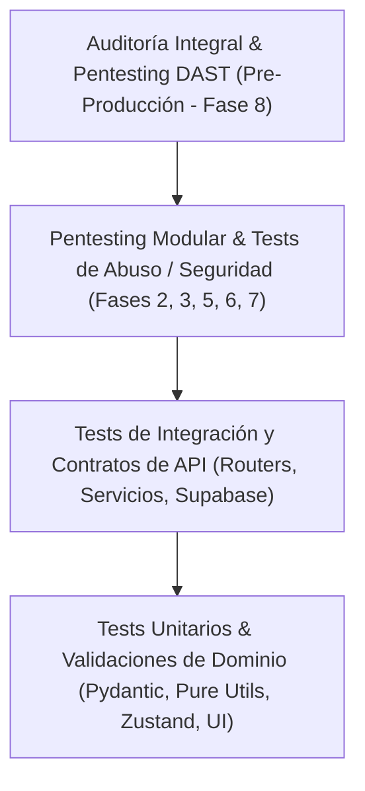

# 🛡️ Especificación de Diseño: Estrategia Híbrida de Testing Diverso y Pentesting

**Fecha:** 2026-09-10  
**Proyecto:** Los Arrayanes E-commerce  
**Estado:** Aprobado en Brainstorming — Pendiente de Plan de Implementación  
**Autor:** Antigravity & Enekon  

---

## 1. Resumen Ejecutivo
El presente documento formaliza la estrategia integral y transversal de aseguramiento de calidad (QA) y seguridad de aplicaciones (AppSec) para el e-commerce de **Los Arrayanes**.  
Se adopta un **modelo híbrido**:
1. **Tests unitarios diversos y pentests modulares específicos** integrados en cada fase de desarrollo (Fases 2 a 7).
2. **Auditoría integral y pentesting pre-producción** como compuerta de validación en la Fase 8 previa al despliegue productivo.

---

## 2. Pirámide de Pruebas del Modelo Híbrido

---

## 3. Matriz Detallada de Pruebas por Fase

### 🗄️ Fase 2: Base de Datos & Supabase (Fase Activa)
* **Tests Unitarios & Integración:**
  - Validación de esquemas Pydantic v2 frente a entradas límite (precios = 0, slugs con caracteres especiales, campos vacíos o tipos erróneos).
  - Verificación de consistencia y orden de ejecución de scripts DDL y Seeds mediante `pytest`.
* **Pentesting & Seguridad Defensiva:**
  - **Prueba de Vulnerabilidad RLS / PostgREST (Anon Key Access):**
    - Simular peticiones PostgREST autenticadas únicamente con la clave pública (*anon key*).
    - Verificar que un usuario anónimo NO pueda modificar ni eliminar filas en `products` o `categories`.
    - Verificar que la tabla sensible `admin_users` esté bloqueada para lectura pública.
    - Confirmar que no se puedan insertar órdenes directamente saltándose la API.
  - **Prueba de Inyección de Tipos y Restricciones CHECK:**
    - Intentar insertar variantes con `stock < 0` o `price < 0` para validar que las restricciones a nivel de motor PostgreSQL rechacen transacciones corruptas.

---

### 🌐 Fase 3: Backend — Catálogo y APIs Públicas
* **Tests Unitarios:**
  - Cálculo matemático de paginación (límites, offsets, páginas totales).
  - Serialización y saneamiento estricto de salidas mediante schemas Pydantic.
  - Pruebas aisladas en `product_service.py` mockeando el cliente de base de datos.
* **Pentesting & Seguridad Defensiva:**
  - **Inyección y Fuzzing en Parámetros REST:**
    - Enviar payloads con sintaxis maliciosa (`?category=eq.1;DROP...`, caracteres nulos `%00`, scripts XSS) en `/api/products` y `/api/products/search`.
  - **Resource Exhaustion / Evasión de Paginación:**
    - Probar valores abusivos (`?limit=1000000000` o `?page=-1`) para validar que la API imponga un límite superior rígido (ej. máximo 50 items por página).
  - **Fuzzing de Caracteres Unicode en Slugs:**
    - Probar caracteres de control, emojis y longitudes extremas en `/api/products/{slug}` verificando retornos limpios `404 Not Found` sin fugas de stack trace.

---

### 🎨 Fase 4: Frontend — Catálogo y Diseño
* **Tests Unitarios:**
  - Renderizado atómico de componentes UI (`Button`, `Badge`, `Card`, `Skeleton`).
  - Accesibilidad básica (ARIA attributes, estados de foco y contraste).
* **Pentesting & Seguridad Frontend:**
  - Prevención de XSS reflejado en componentes que renderizan parámetros de búsqueda (`q`) o descripciones de producto.
  - Saneamiento de URLs de imágenes externas en componentes de catálogo.

---

### 🛒 Fase 5: Carrito y Cotizador de Envíos
* **Tests Unitarios:**
  - Operaciones del store de Zustand (`useCartStore`): `addItem`, `removeItem`, `updateQuantity`, vaciado y cálculo reactivo de subtotales.
  - Persistencia y rehidratación limpia desde `localStorage`.
  - Tests unitarios en backend para el cotizador de envíos según rangos de códigos postales.
* **Pentesting & Seguridad Defensiva:**
  - **Tampering de Estado Local (Client-Side Cart Manipulation):**
    - Simular manipulación directa en el `localStorage` del navegador (ej. cambiar precio unitario a $0 o cantidad a un número negativo como `-5`).
    - Verificar que el backend ignore completamente precios enviados por el cliente y recalcule siempre contra la base de datos oficial.
  - **Fuzzing de Códigos Postales:**
    - Enviar códigos postales corruptos, alfanuméricos o con inyecciones a `/api/shipping/quote`, verificando manejo de error controlado sin caídas de servidor.

---

### 💳 Fase 6: Checkout, MercadoPago y Webhooks *(Núcleo Crítico)*
* **Tests Unitarios:**
  - Algoritmo de cálculo de total de orden (subtotal de variantes + costo de envío cotizado = total exacto).
  - Generación de snapshot inmutable en `order_items` preservando título, SKU y precio de compra.
  - Generación de número de pedido correlativo y único (`ORD-YYYY-NNNNN`).
* **Pentesting & Pruebas de Anti-Fraude:**
  - **Price Tampering:**
    - Intentar crear una orden enviando precios arbitrarios. El backend debe sobreescribir con los precios vigentes de `product_variants`.
  - **Falsificación de Webhooks (HMAC Spoofing):**
    - Simular peticiones `POST /api/webhooks/mercadopago` con estado `approved` sin cabecera de firma `x-signature` ➔ Debe retornar `401 Unauthorized`.
    - Simular peticiones con firma manipulada ➔ Debe retornar `403 Forbidden`.
  - **Ataques de Repetición (Replay Attacks & Idempotencia):**
    - Enviar el mismo payload de pago aprobado 5 veces continuas. Verificar que la orden solo se marque como `paid` una vez y no se produzca descuento repetido de inventario.
  - **Condiciones de Carrera en Stock (Concurrency & Race Conditions):**
    - Simular mediante peticiones asíncronas paralelas concurrentes (`asyncio.gather`) 10 compras simultáneas sobre un producto con `stock = 1`.
    - Solo 1 transacción debe procesarse con éxito; las 9 restantes deben recibir respuesta de falta de disponibilidad sin inconsistencias de stock negativo.

---

### 🔐 Fase 7: Panel de Administración & Autenticación
* **Tests Unitarios:**
  - Generación, firma y verificación de tokens JWT con algoritmos robustos (HS256/RS256).
  - Hashing y verificación de contraseñas con bcrypt (cost factor adecuado y salting).
* **Pentesting & Pruebas de Autorización:**
  - **BOLA / IDOR (*Broken Object Level Authorization*):**
    - Intentar acceder o mutar pedidos privados o productos administrativos sin cabecera `Authorization`.
    - Intentar ejecutar mutaciones con tokens de usuarios no administradores.
  - **Ataques a Tokens JWT:**
    - Probar bypasses comunes: token con `alg: none`, token expirado, y alteración de claims en el payload sin re-firmar.
  - **Protección contra Fuerza Bruta (Brute-Force Attack):**
    - Simular 20 intentos fallidos continuos contra `/api/admin/auth/login`. Verificar la activación de rate limiting temporal o bloqueo.

---

### 🚀 Fase 8: Auditoría Integral Pre-Producción
* **Auditoría Estática de Seguridad (SAST):**
  - Escaneo de vulnerabilidades en dependencias de Python mediante `pip-audit`.
  - Escaneo de paquetes Node.js mediante `npm audit`.
  - Análisis estático de código Python con `bandit`.
* **Auditoría Dinámica (DAST) y Cabeceras HTTP:**
  - Validación de cabeceras de seguridad:
    - `Strict-Transport-Security` (HSTS).
    - `X-Content-Type-Options: nosniff`.
    - `X-Frame-Options: DENY`.
    - `Content-Security-Policy` (CSP).
    - CORS con dominios de origen estrictamente restringidos.
  - Verificación final de que ninguna variable de entorno sensible (`SERVICE_ROLE_KEY`, `JWT_SECRET`, credenciales productivas de MercadoPago) se exponga al cliente.

---

## 4. Política de Dependencias y Librerías
Siguiendo las reglas de [`GEMINI.md`](file:///c:/Users/Enekon/Desktop/Ecommerce/GEMINI.md), cualquier herramienta de testeo o seguridad requerida (`pip-audit`, `bandit`, `pytest-cov`, etc.) será consultada y explicada previamente al usuario antes de su instalación o configuración.
