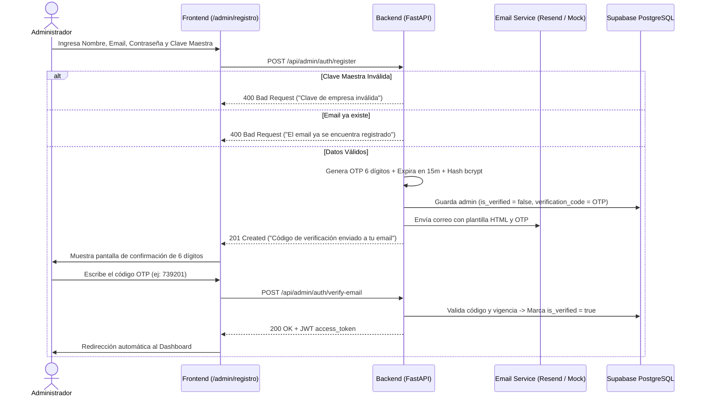

# Especificación Técnica: Registro de Admin con Verificación de Email y Clave Maestra

## 1. Visión General
Permitir a los administradores de **Natbell E-commerce (Los Arrayanes)** crear su cuenta con su propio nombre, email y contraseña deseada, implementando un doble cerco de seguridad:
1. **Clave Maestra de Seguridad (Invite Code):** Solo personas autorizadas con la clave secreta de la empresa pueden iniciar el registro.
2. **Verificación de Identidad por Email (OTP de 6 dígitos):** El sistema envía un código temporal de 6 dígitos para verificar que el email pertenece al administrador antes de habilitar el acceso.
3. **Recuperación de Contraseña:** Capacidad de restablecer la contraseña en caso de olvido mediante el mismo mecanismo de validación por correo.

---

## 2. Diagrama de Flujo



---

## 3. Modelo de Datos y Migración

### Migración `008_admin_email_verification.sql`
```sql
ALTER TABLE admin_users 
ADD COLUMN IF NOT EXISTS is_verified BOOLEAN NOT NULL DEFAULT TRUE,
ADD COLUMN IF NOT EXISTS verification_code VARCHAR(10),
ADD COLUMN IF NOT EXISTS verification_code_expires_at TIMESTAMPTZ,
ADD COLUMN IF NOT EXISTS reset_password_code VARCHAR(10),
ADD COLUMN IF NOT EXISTS reset_password_expires_at TIMESTAMPTZ;
```

---

## 4. Servicio de Email y Proveedor (Resend)

Se implementa `app/services/email_service.py` utilizando `httpx.AsyncClient` contra la API de Resend (`https://api.resend.com/emails`):
- **Cero dependencias adicionales:** Utiliza `httpx` nativo de FastAPI.
- **Fallback transparente:** Si `RESEND_API_KEY` no está configurada, el sistema entra en modo simulación (imprime el código OTP en la consola del backend y no bloquea el desarrollo local).
- **Plantilla HTML cuidada:** Correo con diseño profesional, logo de Natbell, tipografía clara y el código de 6 dígitos destacado.

---

## 5. Endpoints de API

1. `POST /api/admin/auth/register`:
   - Payload: `AdminRegisterRequest(name, email, password, invite_code)`
   - Response: `{"message": "Código de verificación enviado", "email": "..."}`
2. `POST /api/admin/auth/verify-email`:
   - Payload: `AdminVerifyEmailRequest(email, code)`
   - Response: `AdminLoginResponse(access_token, token_type, user)`
3. `POST /api/admin/auth/resend-code`:
   - Payload: `{"email": "..."}`
   - Response: `{"message": "Nuevo código enviado"}`
4. `POST /api/admin/auth/forgot-password`:
   - Payload: `AdminForgotPasswordRequest(email)`
   - Response: `{"message": "Si el correo está registrado, se envió un código"}`
5. `POST /api/admin/auth/reset-password`:
   - Payload: `AdminResetPasswordRequest(email, code, new_password)`
   - Response: `{"message": "Contraseña actualizada exitosamente"}`
6. `POST /api/admin/auth/login`:
   - Si `is_verified == False`, retorna `403 Forbidden` con detalle explicativo.

---

## 6. Vistas en Frontend

- **`/admin/registro`:**
  - Formulario de registro en dos pasos (Paso 1: Datos + Clave Maestra, Paso 2: Input de 6 dígitos).
- **`/admin/login`:**
  - Botón "¿Sos nuevo administrador? Registrate con la clave de empresa".
  - Enlace "¿Olvidaste tu contraseña?" con modal de recuperación por correo.
