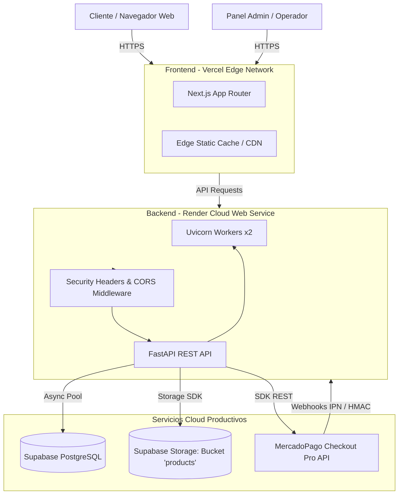

# Fase 8: Deploy y Puesta en Producción — Especificación Técnica

## 1. Visión General y Objetivos
El objetivo principal de la **Fase 8** es llevar el ecosistema de **Natbell E-commerce (Los Arrayanes)** a producción con arquitectura cloud de alta disponibilidad, seguridad de grado bancario y costo eficiente:
- **Backend (FastAPI):** Desplegado en **Render** como Web Service continuo mediante Dockerfile multi-etapa optimizado o entorno nativo Python con Uvicorn multi-workers y health check `/api/health`.
- **Frontend (Next.js 14+):** Desplegado en **Vercel** con CI/CD automático, SSR/SSG optimizado, compresión Edge y headers de seguridad.
- **Base de Datos & Storage (Supabase):** PostgreSQL gestionado en la nube con backups automáticos, Row Level Security (RLS) activo y bucket público de Storage (`products`) para imágenes de catálogo.
- **Pasarela de Pagos (MercadoPago):** Soporte productivo con conmutación sin downtime (`MERCADOPAGO_SANDBOX=False`), credenciales seguras y recepción de webhooks firmados criptográficamente.
- **Pentesting & Seguridad Pre-Deploy:** Hardening de cabeceras HTTP (HSTS, CSP, X-Frame-Options, X-Content-Type-Options, Referrer-Policy), CORS dinámico estricto y auditoría automatizada de dependencias y secretos.

---

## 2. Arquitectura de Despliegue

---

## 3. Especificación de Módulos

### Módulo 1: Hardening de Seguridad & Middleware HTTP
- **CORS Estricto de Producción:** Permitir orígenes configurables vía variable de entorno `ALLOWED_ORIGINS` (por defecto el dominio de Vercel del cliente y localhost para staging/dev local).
- **Security Headers Middleware en FastAPI:**
  - `Strict-Transport-Security: max-age=63072000; includeSubDomains; preload`
  - `X-Frame-Options: DENY`
  - `X-Content-Type-Options: nosniff`
  - `Referrer-Policy: strict-origin-when-cross-origin`
  - `Permissions-Policy: camera=(), microphone=(), geolocation=()`
  - `Content-Security-Policy`: Definir directivas defensivas permitiendo recursos propios, fuentes de Google Fonts, imágenes de Supabase Storage y SDKs de MercadoPago.

### Módulo 2: Infraestructura y Despliegue Backend (Render)
- **`Dockerfile` Multi-Etapa:**
  - Base: `python:3.13-slim`
  - Etapa builder: instalación de dependencias aisladas sin artefactos de compilación ni caché.
  - Etapa runtime: usuario no-root por seguridad, exposición de puerto `$PORT` (dinámico de Render), comando `uvicorn app.main:app --host 0.0.0.0 --port ${PORT:-8000} --workers 2`.
- **`render.yaml` (Infraestructura como Código):**
  - Declaración del Web Service, runtime docker o python, plan free/starter, health check endpoint `/api/health`.
- **Variables de Entorno Productivas (`backend/.env.production.example`):**
  - `SUPABASE_URL`, `SUPABASE_SERVICE_KEY`, `SUPABASE_ANON_KEY`
  - `MERCADOPAGO_ACCESS_TOKEN`, `MERCADOPAGO_PUBLIC_KEY`, `MERCADOPAGO_WEBHOOK_SECRET`, `MERCADOPAGO_SANDBOX=False`
  - `JWT_SECRET_KEY` (clave criptográfica de al menos 64 caracteres)
  - `ALLOWED_ORIGINS`, `FRONTEND_URL`, `BACKEND_URL`

### Módulo 3: Configuración Frontend (Vercel)
- **`frontend/vercel.json`:**
  - Definición de cabeceras de seguridad y caching para rutas estáticas.
  - Reglas de compresión y proxy si fuese necesario.
- **Variables de Entorno Productivas (`frontend/.env.production.example`):**
  - `NEXT_PUBLIC_API_URL` (URL pública del servicio en Render, ej. `https://natbell-api.onrender.com`).
  - `NEXT_PUBLIC_MP_PUBLIC_KEY` (si se requiere para componentes de frontend).

### Módulo 4: Transición Productiva de Pasarelas & Supabase
- **MercadoPago:**
  - Configuración explícita en `app/config.py` para alternar modo sandbox y credenciales de producción (`APP_USR-...`).
  - Registro de endpoint de webhook público `https://<backend-render>/api/webhooks/mercadopago` en el dashboard de MercadoPago.
- **Supabase Storage:**
  - Verificación del bucket público `products` para serving de imágenes CDN.
  - Auditoría de políticas RLS para evitar mutaciones directas anónimas.

### Módulo 5: Smoke Tests E2E y Auditoría de Pre/Post-Deploy
- Script Python [`scripts/smoke_test_production.py`](file:///c:/Users/Enekon/Desktop/Ecommerce/scripts/smoke_test_production.py):
  - Verifica salud del servidor (`GET /api/health`).
  - Verifica presencia de cabeceras de seguridad (HSTS, nosniff, etc.).
  - Verifica catálogo público (`GET /api/products`, `/api/categories`, `/api/brands`).
  - Verifica cotizador de envíos (`GET /api/shipping/quote?postal_code=1000`).
  - Verifica rechazo no autorizado en panel admin (`GET /api/admin/orders` -> 401).
- Auditoría SAST:
  - `npm audit` en frontend (0 vulnerabilidades).
  - Linter y tipado estricto en backend y frontend.
